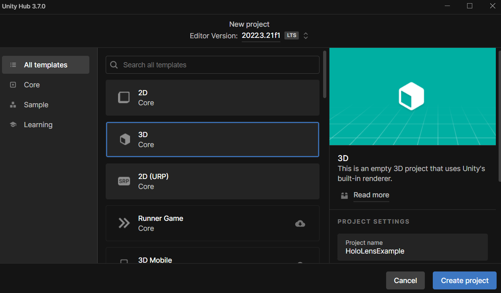
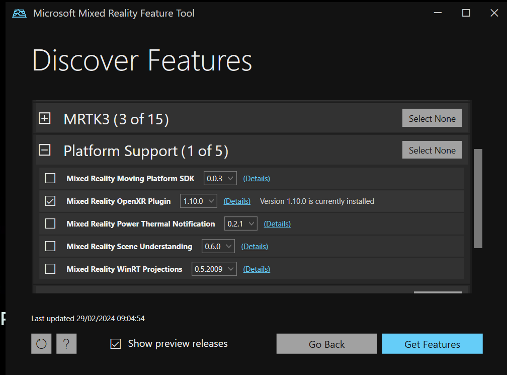
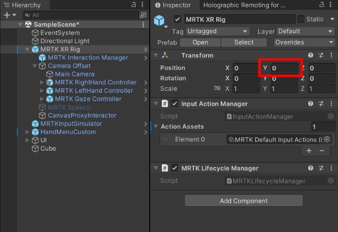
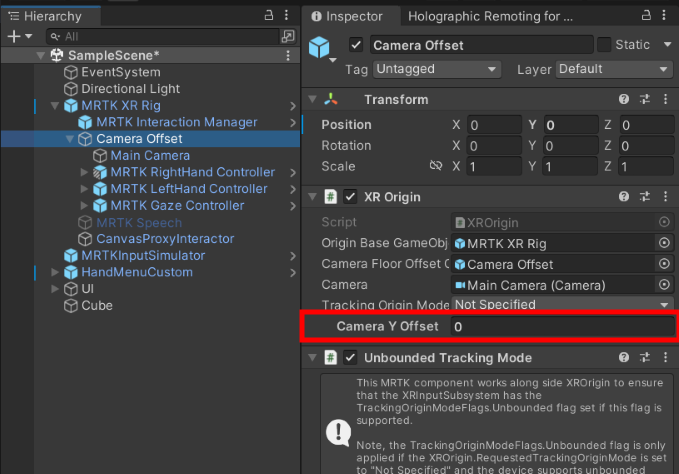

# Développer avec HoloLens 2 sur Unity

***

Maintenant que nous avons pris le casque de réalité mixte en mains, nous pouvons commencer à préparer notre environnement de développement.

## Création du projet Unity

Nous allons en premier lieu créer un projet Unity. Il est important que la version d’Unity soit la **2022.3.21f1** afin d’éviter tout problème de compatibilité avec les packages MRTK. Il faut donc créer un projet 3D vierge. Le nom du projet importe peu.

<figure markdown="span">
    
    <figcaption>Création d'un projet 3D sur Unity</figcaption>
</figure>

Une fois notre projet Unity créé, Nous allons nous diriger vers `File` &rarr; `Build Settings`, puis changer la plateforme pour `Universal Windows Platform`. Ensuite, nous pouvons fermer l’éditeur et passer à l’installation du **Mixed Reality Feature Tool (MRTK)**.

## Mixed Reality Feature Tool

Le Mixed Reality Feature Tool, ou MRTK, est une librairie permettant aux développeurs de programmer plus facilement leurs applications pour les casques de réalité mixte. Il est disponible pour Unreal et Unity. Dans notre cas, nous utiliserons Unity. 

!!! info

    [Suivez le guide](https://learn.microsoft.com/fr-fr/windows/mixed-reality/develop/unity/new-openxr-project-with-mrtk) officiel de Microsoft.

!!! warning

    N’allez pas plus loin que l’étape 4 de la section `Importer les packages Mixed Reality Toolkit et OpenXR`, car nous n’installons pas les mêmes librairies.

Une fois les étapes précédentes réalisées, Il faut cocher plusieurs librairies. Dans `MRTK3`, cochez : `MRTK Input`, `MRTK Standard assets` et `MRTK UX Components`.

<figure markdown="span"></figure>

Dans `Platform Support`, sélectionnez `Mixed Reality OpenXR Plugin`.

<figure markdown="span"></figure>

Ensuite, cliquez sur `Get Features`. Patientez un moment pendant que le logiciel télécharge les données. Une fois le téléchargement terminé, le logiciel va afficher la page suivante :

<figure markdown="span"></figure>

Cliquez sur le bouton `Validate` pour vérifier la bonne installation des librairies. Un message s’ouvrira sur votre ordinateur vous indiquant le bon fonctionnement des nouvelles fonctionnalités. Cliquez sur `Ok`. Maintenant, cliquez sur le bouton `Import`, puis le bouton `Approve` et enfin, sur le bouton `Exit`. 

## Configuration du projet Unity 

Une fois l’outil d’installation fermé, vous pouvez retourner sur votre projet Unity. Ensuite, suivez les indications de la vidéo pour configurer votre projet Unity.

<iframe width="100%" height="415" src="https://www.youtube.com/embed/aVnwIq4VUcY?si=UM9FX5VL6A2TDMps&amp;start=1090" title="YouTube video player" frameborder="0" allow="accelerometer; autoplay; clipboard-write; encrypted-media; gyroscope; picture-in-picture; web-share" allowfullscreen></iframe>

Il se peut que certaines interfaces n’apparaissent pas, notamment à **21:50**, il suffit juste d’aller dans `Edit` &rarr; `Project Settings` &rarr; `XR Plug-in Management` (tout en bas à gauche) pour avoir la même fenêtre. 

Lors de l’ajout de la caméra dans le projet, il est possible que votre caméra ne soit pas correctement placer et vous ne voyez donc pas ce que vous avez ajouté dans votre scène, vérifier que la position en Y de `MRTK XR RIG` est à 0 et que son enfant `Camera Offset` à dans son composant `XR Origin` la partie `Camera Y Offset` à 0.

<figure markdown="span"></figure>

<figure markdown="span"></figure>

Et voilà, votre projet et prêt, il ne reste plus qu’à pouvoir lancer votre projet sur votre casque Hololens 2 pour pouvoir le tester. Pour cela allez à la prochaine section où l’on vous montre comment lancer votre projet sur votre casque sans avoir besoin de build votre projet.