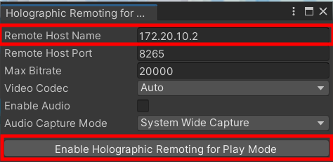

# Lancement du projet sur Hololens 2

***

Pour pouvoir tester notre projet Unity, plusieurs solutions sont disponibles :

* Unity possède un émulateur intégré d’HoloLens, permettant de tester sans le casque.
* On peut installer un logiciel sur le casque permettant d’envoyer le projet directement sur le casque grâce au réseau WIFI.

!!! info

    Dans notre cas, nous allons principalement utiliser la deuxième solution car il est plus simple pour nous de tester directement sur le casque et il est plus facile d’effectuer certaines actions.

## Installation du logiciel Holographic Remoting Player

Le logiciel Holographic Remoting Player est très simple d’installation. Sur le casque, ouvrez l’application Microsoft Store, puis recherchez `Holographic Remoting Player`. Sélectionnez le logiciel montré ci-dessous et installez le.

<figure markdown="span">
    
    <figcaption>Logiciel Holographic Remoting Player</figcaption>
</figure>

Une fois le logiciel installé, vous pouvez l’exécuter. 

!!! info

    Si vous ne trouvez pas le logiciel en question, il est disponible cette [adresse](https://apps.microsoft.com/detail/9nblggh4sv40?hl=fr-FR&gl=PT).

## Mise en place du logiciel avec Unity 

Si vous lancez le logiciel, vous verrez un message s’afficher qui indique que l’application est en attente d’un signal. Plus bas, vous verrez que votre IP est renseignée. Vous allez en avoir besoin pour relier le casque à Unity. 

Dans Unity, cliquez sur `Mixed Reality` en haut de l’éditeur, puis passez votre souris sur `Remoting` pour enfin cliquer sur `Holographic Remoting for Play Mode`. Une nouvelle fenêtre devrait s’ouvrir.

<figure markdown="span"></figure>

Dans cette nouvlle fenêtre, il vous faudra renseigner l’adresse IP renseignée par le casque dans le champ `Remote Host Name`. Vous pouvez changer d’autres paramètres tels que le port (ne pas changer) le Max Bitrate[^1], l’encodeur vidéo, une case pour activer l’audio et un sélecteur pour le mode de capture audio. Quand les paramètres vous conviennent, cliquez sur le bouton `Enable Holographic Remoting for Play Mode`.

<figure markdown="span"></figure>

Une fois toutes les étapes ci-dessus réalisées, vous pouvez lancer votre projet sur le casque de réalité mixte HoloLens 2. Si rien ne se passe vérifiez que :

* Le casque et l’ordinateur sont connectés sur le même réseau WIFI
* Le logiciel Holographic Remoting Player soit en cours d’exécution sur le casque

!!! info

    Notez qu’il est possible que cela ne fonctionne pas sur certains réseaux publics ou universitaires.

[^1]: Débit maximum accordé