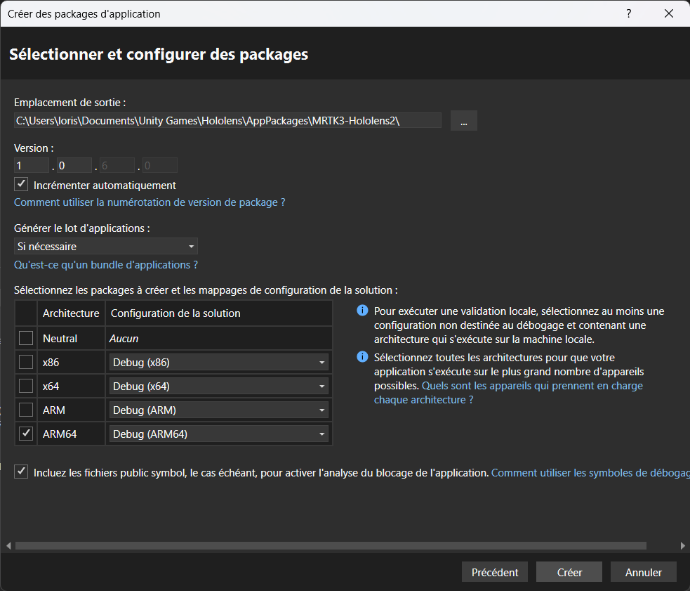
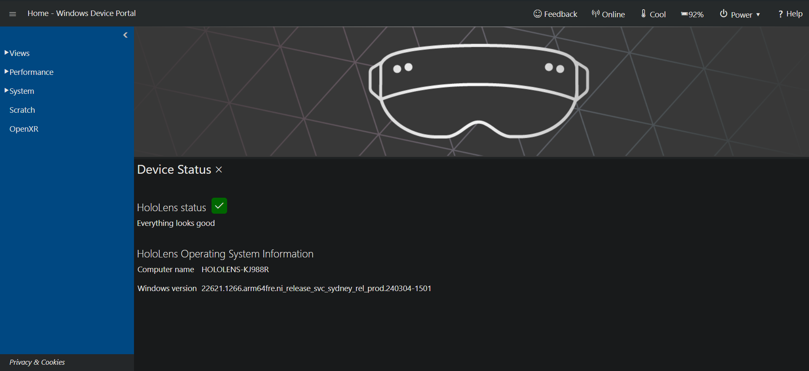

# Build son projet et le déployer sur le casque HoloLens

***

Build votre projet sur le casque HoloLens vous permet de le lancer directement sur le casque en tant qu'application, et cela permet aussi à votre projet d'accéder aux caméras du casque. Vous aurez besoin de l'activer sur le casque et sur votre PC windows 10/11.

## Activer le mode développeur

### Sur HoloLens

Rendez-vous dans les Paramètres, puis allez dans `Mise à jour et sécurité` &rarr; `Pour les développeurs` et activez tout ce qui peut l'être.

<figure markdown="span">
    
    <figcaption>Activation du mode développeur sur HoloLens 2</figcaption>
</figure>

Après cela, suivez les instructions de la vidéo pour pouvoir vous connécter au casque via un même réseau.

!!! info

    Notez qu’il est possible que cela ne fonctionne pas sur certains réseaux publics ou universitaires.

<iframe width="100%" height="415" src="https://www.youtube.com/embed/0yyM_lcg1g0?si=Zl-qUr-g8Qk380YZ" title="YouTube video player" frameborder="0" allow="accelerometer; autoplay; clipboard-write; encrypted-media; gyroscope; picture-in-picture; web-share" referrerpolicy="strict-origin-when-cross-origin" allowfullscreen></iframe>

!!! warning "Important"

    Choisisez bien vos identifiants car vous en aurez besoins plus tard pour build le projet.

### Sur Windows 10

Rendez-vous dans les Paramètres, puis allez dans `Mise à jour et sécurité` &rarr; `Espace développeurs` et activez `Mode développeur`.

### Sur Windows 11

Rendez-vous dans les Paramètres, puis allez dans `Système` &rarr; `Espace développeurs` et activez `Mode développeur`.

## Build le projet sur Unity

Pour build votre projet avec Unity, allez dans `File` &rarr; `Build settings...`, vous pouvez y accéder vie le raccourcis ++ctrl+shift+b++

!!! warning "Important"

    Pensez à ajouter vos scène en appuyant sur le bouton `Add Open Scenes` en étant sur la scène que vous voulez ajouter.

<figure markdown="span">
    
    <figcaption>Build du projet sur Unity</figcaption>
</figure>

Si vous n'êtes pas déjà sur la bonne plateforme, choisisez la plateforme `Universal Windows Platefrom` et cliquez sur `Switch platefrom`. Une fois fait, mettez les mêmes paramètres que sur l'image. Une fois tout cela fait, vous pouvez build le projet en appuyant sur le bouton `Build`

## Publier le projet avec Visual Studio

Une fois votre build finis, ouvrez le fichier `[NomDeVotreProjet].sln` avec Visual Studio. Sur la droite de votre fenêtre Visual Studio, faites un clique droit sur `[NomDeVotreProjet] (Universal Windows)` et cliquez sur `Publier` &rarr; `Créer des packages d'applications...`

<figure markdown="span"></figure>

<figure markdown="span"></figure>

Vous aurez une nouvelle fenêtre qui souvrira, les 2 premières étapes il n'y a rien à modifier, mais pour la dernière, mettez les mêmes modifications que sur l'image ci-dessous :

<figure markdown="span"></figure>

Une fois cela fait, appuyez sur `Créer`, cela va vous créer des fichiers permettants de déployer votre projet sur le casque HoloLens.

## Déployer le projet sur le casque

Une fois que vous avez build votre projet avec Unity et créé les packages d'application avec Visual Studio, nous pouvons maintenant déployer l'application sur le casque, pour cela il faut que votre PC et votre casque soient sur le même réseau.

!!! info

    Notez qu’il est possible que cela ne fonctionne pas sur certains réseaux publics ou universitaires.

Entrez l'adresse IP réseau du casque dans votre barre de recherche et entrez vos identifiants créé plus tôt pour pouvoir accéder à cette page :

<figure markdown="span"></figure>

!!! info

    Vous pouvez trouver cette adresse IP en allumant le logiciel `Holographic Remoting Player` ou alors retournez dans les paramètres au même endroit ou vous avez activé le mode développeur, puis tout en bas vous aurez alors 3 liens dont 1 pour la connection Wi-Fi. Ce lien est vitre adresse IP réseau.

Suivez ensuite les étapes de cette vidéo :

<iframe width="100%" height="415" src="https://www.youtube.com/embed/jNyF4Whh_Uw?si=Q8RoXwngWN5xX5TN&amp;start=708" title="YouTube video player" frameborder="0" allow="accelerometer; autoplay; clipboard-write; encrypted-media; gyroscope; picture-in-picture; web-share" referrerpolicy="strict-origin-when-cross-origin" allowfullscreen></iframe>

!!! warning "Important"

    Veillez à avoir une bonne connexion internet, sinon le téléchargement risque d'être très long.

Et voilà vous avez terminé, votre application et maintenant disponible sur le casque directement.