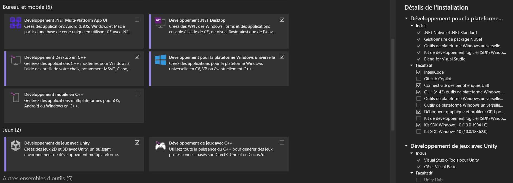

# Prérequis

***

Pour développer des applications en réalité mixte, vous aurez besoins d'installer certains outils et logiciels.

## Installations des outils / logiciels

-   :simple-unity: **Unity**
  
    --- 

    [Télécharger](https://unity.com/fr/download){.md-button}

-   :simple-visualstudio: **Visual Studio**

    ---

    [Télécharger](https://visualstudio.microsoft.com/fr/downloads/){.md-button}

-   :material-mixed-reality: **MRTK**

    ---

    [Télécharger](https://www.microsoft.com/en-us/download/details.aspx?id=102778){.md-button}

## Configuration de Visual Studio

Pour pouvoir programmer et déployer nos applications avec Visual Studio nous aurons besoins de télécharger certains composants en plus qui sont disponible via Visual Studio. Voici la liste :

* Développement .NET Desktop
* Développement Desktop en C++
* Développement UWP (Plateforme Windows universelle)
* Développement de jeux avec Unity (si vous envisagez d’utiliser Unity)
* SDK Windows 10 version 10.0.19041.0 ou 10.0.18362.0, ou SDK Windows 11
* Connectivité de périphérique USB (requise pour le déploiement/débogage vers HoloLens via USB)
* C++ (v142) Outils de la plateforme Windows universelle (requis lors de l’utilisation d’Unity)

<figure markdown="span"></figure>

