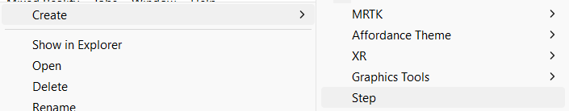
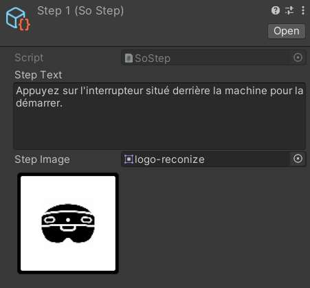

# Créer des nouvelles étapes

***

Dans le projet PolyLens, les étapes sont des **ScriptableObject**[^1], il est donc très simple de créer une nouvelle étape, pour cela faite un click droit puis allez dans `Create >` &rarr; `Step`.

<figure markdown="span">
    
</figure>

Une fois créer, vous pouvez ajouter la description de l'étape ainsi qu'une image (non obligatoire).

<figure markdown="span">
    
</figure>

## Script SoStep

```c#
using UnityEditor;
using UnityEngine;

[CreateAssetMenu(fileName = "New Step", menuName = "Step")]
public class SoStep : ScriptableObject
{
    [Tooltip("Description de l'étape.")]
    [TextArea(5, 10)]
    public string stepText;
    
    [Tooltip("Image de l'étape.")]
    public Sprite stepImage;
}

// Permet d'afficher l'image de l'étape directement dans l'éditeur Unity.
[CustomEditor(typeof(SoStep))]
public class SoStepEditor : Editor
{
    SoStep soStep;

    private void OnEnable()
    {
        soStep = (SoStep)target;
    }
    
    public override void OnInspectorGUI()
    {
        base.OnInspectorGUI();
        if (soStep.stepImage == null) return;
        
        // Récupère le Sprite de l'étape.
        Texture2D sprite = AssetPreview.GetAssetPreview(soStep.stepImage);
        
        // Définis la taille de l'image.
        GUILayout.Label("", GUILayout.Width(sprite.width), GUILayout.Height(sprite.height));
        
        // Affiche l'image de l'étape.
        GUI.DrawTexture(GUILayoutUtility.GetLastRect(), sprite, ScaleMode.ScaleToFit);
    }
}
```

[^1]: Objets spéciaux dans Unity qui permettent de stocker des données dans des fichiers d'assets pouvant être facilement réutilisés et partagés entre les différentes instances de votre jeu.