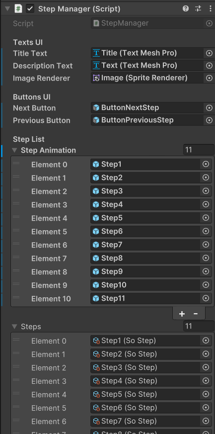

# Explication du script StepManager

***

Dans le projet PolyLens, l'affichages des différentes étapes et animations sont gérés par le script `StepManager` qui suit :

```c# linenums="1"
using TMPro;
using UnityEngine;

/// <summary>
/// Gère les étapes d'utilisation de la machine.
/// </summary>
public class StepManager : MonoBehaviour
{
    [Header("Texts UI")]
    [Tooltip("Texte affichant le titre de l'étape.")]
    [SerializeField] private TextMeshPro titleText;
    
    [Tooltip("Texte affichant la description de l'étape.")]
    [SerializeField] private TextMeshPro descriptionText;
    
    [Tooltip("Image affichant l'image de l'étape.")]
    [SerializeField] private SpriteRenderer imageRenderer;
    
    [Header("Buttons UI")]
    [Tooltip("Bouton pour passer à l'étape suivante.")]
    [SerializeField] private GameObject nextButton;
    
    [Tooltip("Bouton pour passer à l'étape précédente.")]
    [SerializeField] private GameObject previousButton;
    
    [Header("Step List")]
    [Tooltip("Liste d'affichage des étapes (animations).")]
    [SerializeField] private GameObject[] stepAnimation;
    
    [Tooltip("Etapes de la machine.")]
    [SerializeField] private SoStep[] steps;
    
    private int currentStepIndex = 1;
    
    private void Start()
    {
        UpdateUI();
    }
    
    /// <summary>
    /// Met à jour les textes de l'interface utilisateur.
    /// </summary>
    private void UpdateTextsUI()
    {
        titleText.text = "Étape " + currentStepIndex + " sur " + steps.Length;
        descriptionText.text = steps[currentStepIndex - 1].stepText;
        if (steps[currentStepIndex - 1].stepImage != null) {
            imageRenderer.sprite = steps[currentStepIndex - 1].stepImage;
        }
    }

    /// <summary>
    /// Met à jour l'affichage des boutons de l'interface utilisateur.
    /// </summary>
    private void UpdateButtonUI()
    {
        previousButton.SetActive(true);
        nextButton.SetActive(true);
        
        if (currentStepIndex == 1) {
            previousButton.SetActive(false);
        } else if (currentStepIndex == steps.Length) {
            nextButton.SetActive(false);
        }
    }
    
    /// <summary>
    /// Met à jour l'affichage des gameobjects.
    /// </summary>
    private void UpdateGameObjects()
    {
        foreach (GameObject go in stepAnimation) {
            go.SetActive(false);
        }
        
        stepAnimation[currentStepIndex - 1].SetActive(true);
    }
    
    /// <summary>
    /// Met à jour l'interface utilisateur.
    /// </summary>
    private void UpdateUI()
    {
        UpdateTextsUI();
        UpdateButtonUI();
        UpdateGameObjects();
    }
    
    /// <summary>
    /// Permet de passer à l'étape suivante.
    /// </summary>
    public void NextStep()
    {
        if (currentStepIndex < steps.Length) {
            currentStepIndex++;
            UpdateUI();
        }
    }
    
    /// <summary>
    /// Permet de passer à l'étape précédente.
    /// </summary>
    public void PreviousStep()
    {
        if (currentStepIndex > 0) {
            currentStepIndex--;
            UpdateUI();
        }
    }
}


```

## Variables

```c# linenums="1"
// Texte qui affiche le titre de l'étape. C'est le texte dans la barre de titre de la SlateTuto.
private TextMeshPro titleText;

// Texte qui affiche la description de l'étape. C'est le texte dans le contenu de la SlateTuto.
private TextMeshPro descriptionText;

// Image affichant l'image de l'étape.
private SpriteRenderer imageRenderer;

// Bouton pour passer à l'étape suivante. C'est le bouton ">" de la SlateTuto.
private GameObject nextButton;

// Bouton pour passer à l'étape précédente. C'est le bouton "<" de la SlateTuto.
private GameObject previousButton;

// Liste d'affichage des étapes (animations).
private GameObject[] stepAnimation;

// Liste des étapes (texte et image)    
private SoStep[] steps;
```

## Fonctions

```c# linenums="1"
// Fonction intégrer à Unity qui s'applique dès le démarrage.
private void Start()
{
    UpdateUI();
}

// Met à jour les textes de l'interface utilisateur.
private void UpdateTextsUI()
{
    // Met à jour le texte du titre de la SlateTuto
    titleText.text = "Étape " + currentStepIndex + " sur " + steps.Length;
    // Met à jour le texte affichant ce qu'il faut faire dans cette étape
    descriptionText.text = steps[currentStepIndex - 1].stepText;
    // Affiche l'image si il y en a une
    if (steps[currentStepIndex - 1].stepImage != null) {
        imageRenderer.sprite = steps[currentStepIndex - 1].stepImage;
    }
}

// Met à jour l'affichage des boutons de l'interface utilisateur.
private void UpdateButtonUI()
{
    // Active tout les boutons
    previousButton.SetActive(true);
    nextButton.SetActive(true);

    // Si première étape, désactive le bouton pour passer à l'étape d'avant
    if (currentStepIndex == 1) {
        previousButton.SetActive(false);
    // Si dernière étape, désactive le bouton pour passer à l'étape d'après
    } else if (currentStepIndex == steps.Length) {
        nextButton.SetActive(false);
    }
}

// Met à jour l'affichage des gameobjects.
private void UpdateGameObjects()
{
    // Désatcive tout
    foreach (GameObject go in stepAnimation) {
        go.SetActive(false);
    }

    // Active l'affichage de l'étape courrante
    stepAnimation[currentStepIndex - 1].SetActive(true);
}

// Met à jour l'interface utilisateur.
private void UpdateUI()
{
    UpdateTextsUI();
    UpdateButtonUI();
    UpdateGameObjects();
}

// Permet de passer à l'étape suivante.
public void NextStep()
{
    if (currentStepIndex < numbersteps.LengthfSteps) {
        currentStepIndex++;
        UpdateUI();
    }
}

// Permet de passer à l'étape précédente.
public void PreviousStep()
{
    if (currentStepIndex > 0) {
        currentStepIndex--;
        UpdateUI();
    }
}
```


## Apperçu dans l'éditeur

<figure markdown="span">
    
</figure>